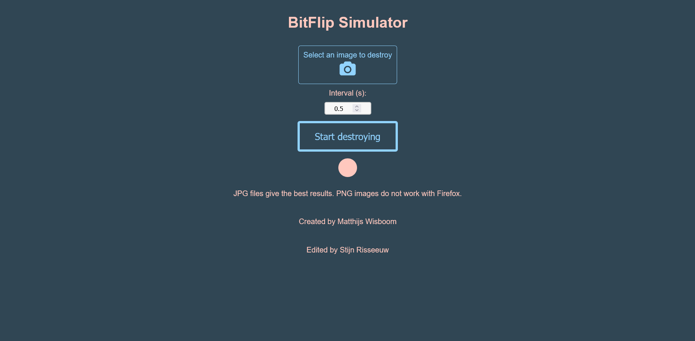

# BitFlipSimulation

A tiny client-side tool to randomly flip bits in an uploaded image and observe visual corruption.

Usage
- Open bitflip.html in your browser.
- Select an image using the file selector.
- Set `Number of flips` for per-action flips.
- Optionally set `Interval (s)` and click `Start destroying` to flip a random bit every interval.
- Click `Stop destroying` to stop the periodic flips.

Notes
- Best results with JPG images. PNGs may not behave correctly in some browsers.
- Runs entirely in the browser — no server required.